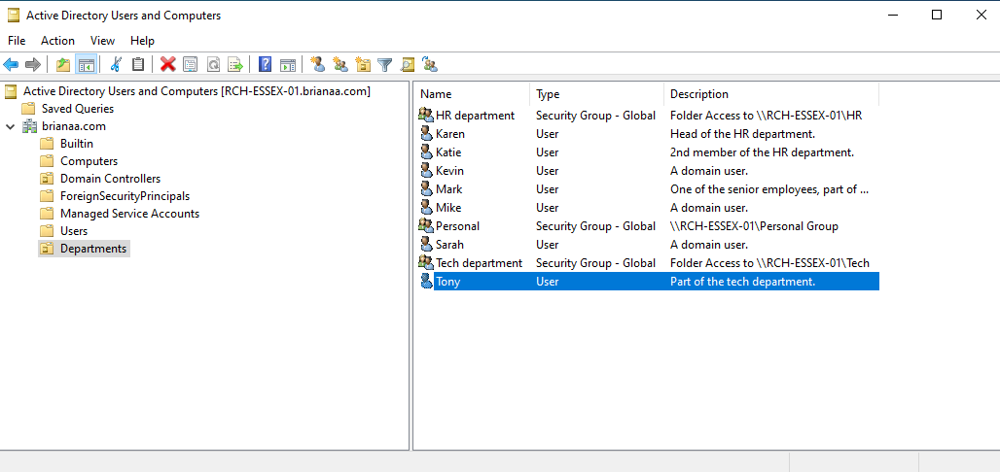
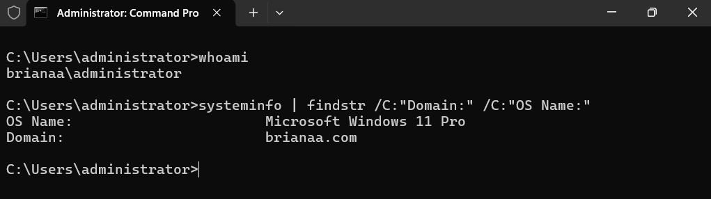
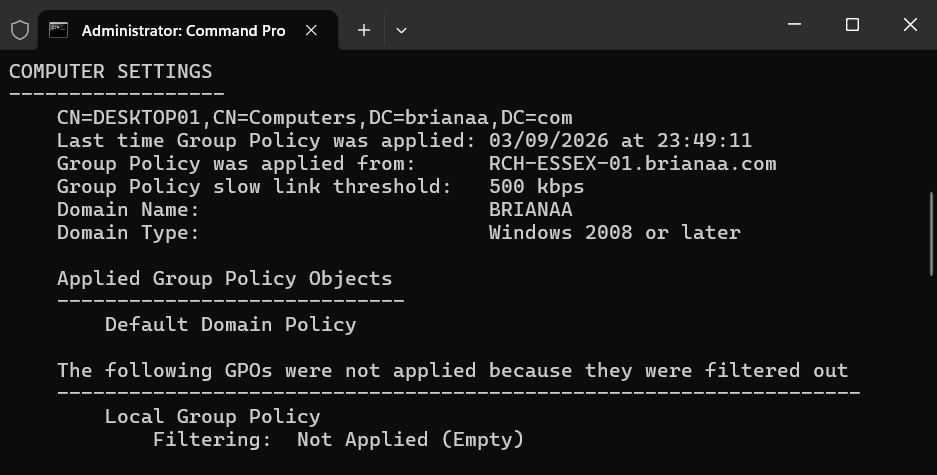
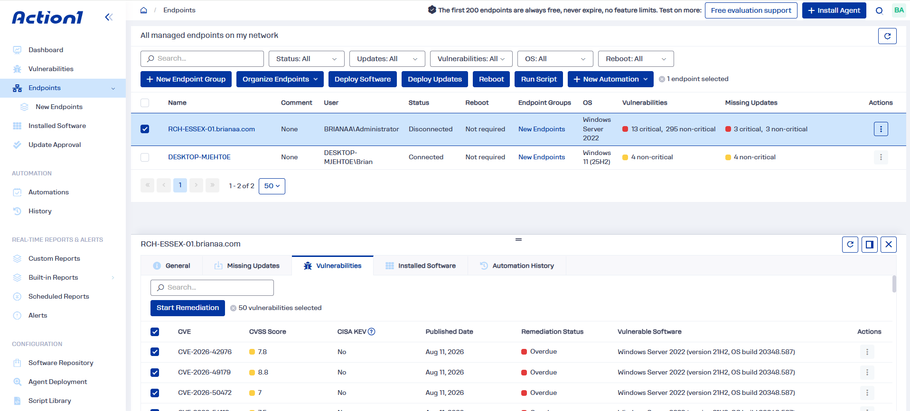

# Enterprise Active Directory & Endpoint Support Lab

A virtualized enterprise IT environment built to simulate real-world Tier 1/2 helpdesk operations, identity administration, endpoint configuration, and patch management.

---

## 🛠️ Environment Architecture & Topology

| Component | Role | OS / Specification | Configuration |
| :--- | :--- | :--- | :--- |
| **Hypervisor** | Virtualization Layer | Oracle VM VirtualBox | Internal/Bridged Network Adapter Setup |
| **DC01** | Primary Domain Controller | Windows Server 2022 | Active Directory Domain Services (AD DS), DNS Server, Static IP |
| **CL01** | Client Endpoint | Windows 11 Enterprise | Domain-Joined Workstation |
| **Action1 RMM**| Remote Monitoring & Mgmt | Cloud SaaS Console | Automated Agent Deployment, CVE & Patch Management |

---

## 🚀 Key Implementations

### 1. Domain Services & Network Infrastructure
* Deployed and promoted **Windows Server 2022** to a Primary Domain Controller running Active Directory Domain Services (AD DS).
* Established internal DNS forwarding and configured static IPv4 addressing to handle authoritative domain resolution.
* Configured virtual network adapters to maintain network isolation while ensuring local communication between endpoints.

### 2. Identity & Access Management (IAM)
* Designed a hierarchical **Organizational Unit (OU)** architecture modeling corporate departments (e.g., `IT`, `HR`, `Finance`, `Workstations`).
* Created and onboarded standard end-user accounts and privileged administrator roles.
* Configured Security Groups for resource access control.
* Simulated Tier 1 helpdesk ticket workflows: password resets, account lockouts, account unlocks, and group membership updates.

### 3. Endpoint Integration
* Configured the Windows 11 network stack, pointing primary DNS directly to the Domain Controller.
* Successfully bound the Windows 11 endpoint to the Active Directory domain.
* Tested and verified initial domain user logins and local user profile generation.

### 4. Group Policy Objects (GPO)
* Configured and enforced domain-wide security policies through the **Group Policy Management Console (GPMC)**:
  * **Password Policies:** Enforced minimum length, complexity, and history requirements.
  * **Account Lockout Policy:** Defined thresholds for invalid login attempts and reset durations.
  * **Desktop & Drive Configuration:** Configured mapped shared network drives and managed desktop restrictions.
* Validated policy inheritance and applied updates on the client using `gpupdate /force` and `gpresult /r`.

### 5. Endpoint & Vulnerability Management (Action1 RMM)
* Integrated the **Action1 RMM** cloud platform with Active Directory for automated endpoint discovery.
* Deployed the Action1 agent across the domain environment.
* Conducted vulnerability audits to identify missing security patches and Common Vulnerabilities and Exposures (CVEs).
* Deployed automated patch remediations and pushed remote third-party software updates silently to the endpoint.

---

## 📸 Verification & Documentation

### 1. Active Directory Architecture & User Management

*Active Directory Users and Computers (ADUC) interface displaying the custom `Departments` Organizational Unit, populated user accounts, and department-specific Global Security Groups.*

### 2. Workstation Domain Integration

*Windows 11 client terminal output confirming domain membership in `brianaa.com` and administrative logon identity via `whoami` and `systeminfo`.*

### 3. Group Policy Enforcement

*Diagnostic report (`gpresult /r`) on the Windows 11 endpoint confirming successful policy processing and enforcement from the primary Domain Controller (`RCH-ESSEX-01`).*

### 4. Cloud RMM & Vulnerability Management

*Action1 cloud dashboard tracking managed infrastructure endpoints, highlighting missing patches, CVSS risk scores, and overdue security CVEs on the Windows Server instance.*

---

## 🔧 Troubleshooting & Obstacles Encountered

* **Issue 1: Domain Controller Not Found During Windows 11 Domain Join**
  * *Symptom:* The Windows 11 client returned an error stating an Active Directory Domain Controller (AD DC) for the domain could not be contacted.
  * *Root Cause:* The client network adapter was using DHCP and pulling external DNS servers (like 8.8.8.8) rather than the local Domain Controller's IP address.
  * *Resolution:* Manually updated the IPv4 adapter settings on the client to assign the Domain Controller's static IP as the Primary DNS. Flushed DNS using `ipconfig /flushdns` and successfully joined the domain.

* **Issue 2: Group Policy Update Failure via `gpupdate /force`**
  * *Symptom:* The client returned an error: *"The processing of Group Policy failed because of lack of network connectivity to a domain controller."*
  * *Root Cause:* Internal virtual network routing was temporarily interrupted between the hypervisor virtual adapters, breaking SMB/RPC access to the SYSVOL share.
  * *Resolution:* Re-verified adapter modes, verified DNS resolution to `brianaa.com` via ICMP ping tests, and successfully applied both Computer and User policies.

---

## 💻 Technical Commands & Diagnostics Utilized

* `ipconfig /all` — Inspected adapter configuration, DHCP lease, and assigned DNS servers.
* `ping [IP / Hostname]` — Tested ICMP reachability between client and server.
* `nslookup [DomainName]` — Verified DNS SRV records and domain resolution.
* `gpupdate /force` — Immediately pulled updated Group Policy objects from the DC.
* `gpresult /r` — Displayed Applied Group Policy objects and security group memberships.
* `net user [username] /domain` — Queried user account parameters directly from the command line.
